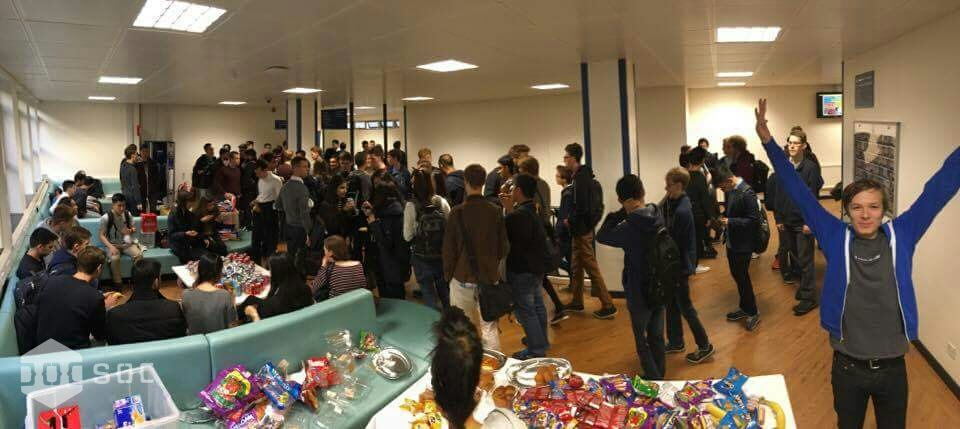
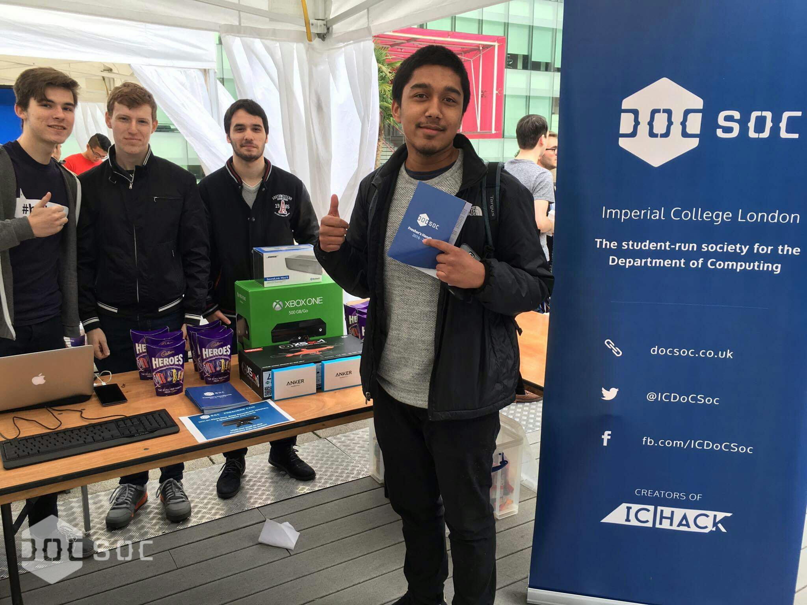
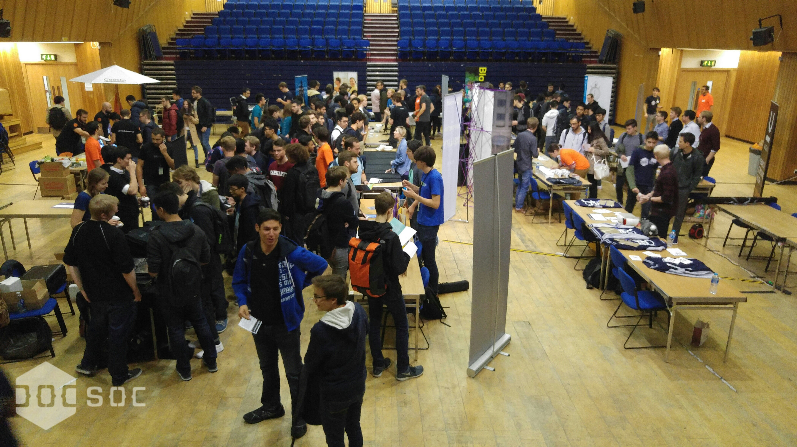
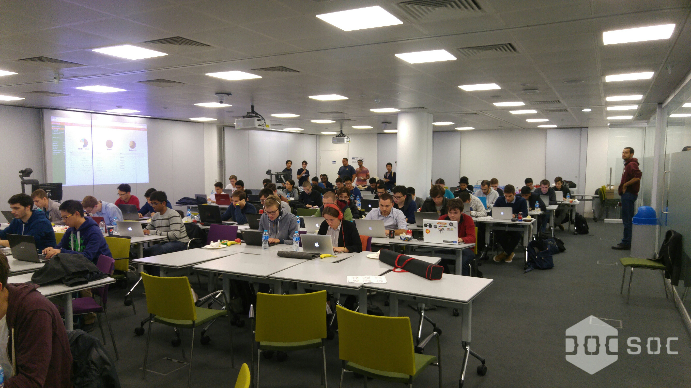
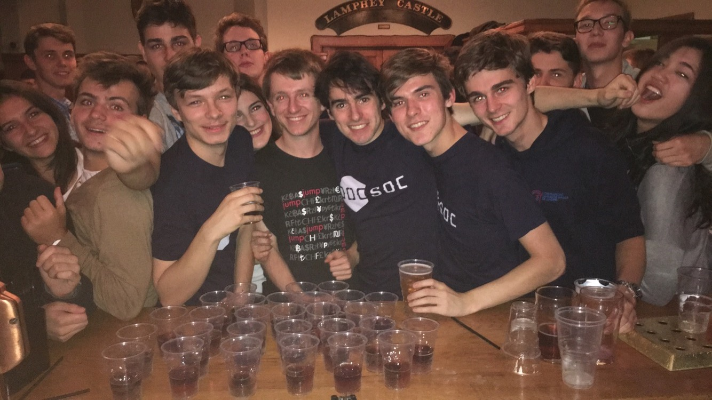
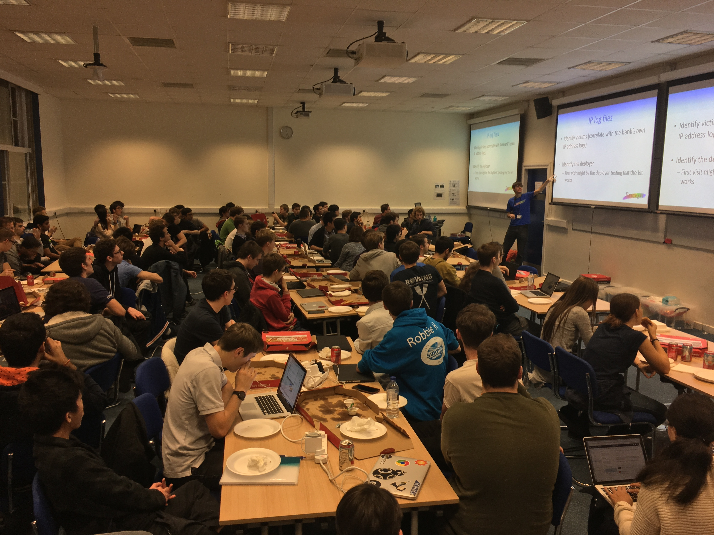
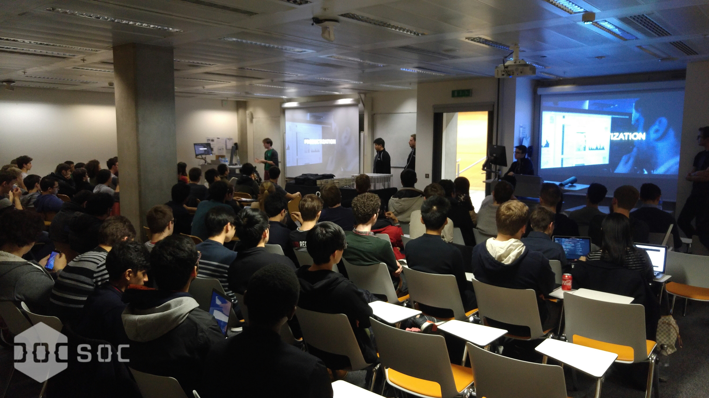
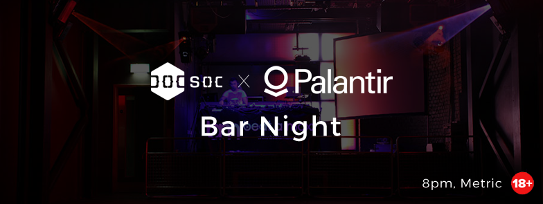

Well, well, well...what a term! DoCSoc has grown from its humble beginnings just a few years ago into one of the largest and most prominent societies at Imperial and even the UK! In fact, this term was our busiest and most active of all time with almost twenty amazing events in just ten weeks. 

So as we all take a well deserved rest from coursework and revision before the Spring term, let’s take a look at what we got up to this term…

Freshers’ Meet and Greet
=======
The first week of term might seem like nothing but a distant memory now, but we woke up bright and early to welcome nervous and excited freshers to the department with a bang. With a huge supply of drinks and snacks, we fed the new students and got chatting to them about the department, our society, and all the great things about attending one of the best universities in the world, in one of the most fantastic cities in the world.

Freshers’ Fair
========================
That same week, we popped up our stall at the Freshers’ Fair and, in true DoCSoc style, we came equipped with lots of food. We also held a speed typing competition with the grand prize being brand new Xbox One! We also gave away other fantastic prizes including wireless headphones, a quadcopter, and a portable speaker. The top score this year was 132 wpm - if you think you can do better, come back next year to try your luck!

*Showing off our prizes!*

Buddies Lunch
==================================
DoCSoc, in collaboration with the departmental representatives, operates a ‘Mums and Dads’ scheme to pair freshers with students from upper years to guide them and give them a reliable contact for advice in the department. To start this bond, we hold a lunch where parents and kids can mingle and get to know each other. Through collaboration with our generous sponsors and our department, we also give each fresher a swag bag packed to the brim with rubber ducks, mugs, stickers and more.

<blockquote class="twitter-video" data-lang="en">
Fresher Swag Bags are packed and they are looking great! Come and collect them at the Mums and Dads meeting next week! <a href="https://twitter.com/icunion">@icunion</a> <a href="https://twitter.com/hashtag/helloicu?src=hash">#helloicu</a> <a href="https://t.co/t57sILV7uj">pic.twitter.com/t57sILV7uj</a>
&mdash; Imperial DoCSoc (@ICDoCSoc) <a href="https://twitter.com/ICDoCSoc/status/782922848767709184">October 3, 2016</a></blockquote>

Sponsors’ Exhibition
==============================================================
Following the success of last year’s Careers Fair, we held a sponsors’ exhibition in the Great Hall - our largest yet! - where we invited over 10 companies including our sponsors and some startups to sell themselves to our students. This proved to be a great success and we hope many students got some great internship and job offers out of the day.

*A full Great Hall!*

Bloomberg’s CodeCon
=============================
The same week, we held Bloomberg’s CodeCon - an online coding competition run simultaneously at universities in the UK and across the world. With pizza, drinks, and recruiters and engineers from Bloomberg there to help, the event proved to be a great success. We’re also proud to say some of our own students ranked in the top 3, resulting in fast tracked interviews at Bloomberg. Well done guys!

*Intense focus on the programming challenge.*

The Welcome Bar Night
=======================
In week three, we introduced freshers to what is now something of a DoCSoc tradition - our regular free bar nights! All members of DoCSoc can come visit us at the Union Bar for a night of free drinks and good conversation. This was perhaps one of the most memorable nights of term (well, if you can remember that night at all), and our most popular bar night in the history of DoCSoc!

*Traditional DoCSoc Jaegerbombs*

Netcraft: Phishing for Fun and Profit
============================
Following the success of last year’s Dark Markets event, our generous sponsor Netcraft returned for another fantastic workshop about phishing. Students learnt how to reverse-engineer the obfuscated code behind real world phishing attacks, and how the process can be used to identify attacks, disrupt fraudsters, and stem the flow of easy money gushing towards the Internet criminals. With pizza and drinks flowing, this event was not only great fun, but extremely interesting!

*Phishing for Fun and Profit*

It wouldn’t be a Netcraft event if it wasn’t followed by a Bar Night! After the event, students and Netcraft staff migrated to the union for drinks and to talk about the work that Netcraft gets up to.

Think Like A Palantir Engineer
================
The same week, we welcomed another of our fantastic sponsors, Palantir, to Imperial for a hands-on problem solving event where students could learn from full-time engineers about how to approach problems such as terrorism and financial fraud. Not only was the event very eye opening, but also taught us more about what Palantir does and how they work. The event was followed by a question and answer session where eager students could find out more about life at Palantir.

*Questions and answers...*

Palantir Bar Night
=================================
After Palantir’s workshop event, we all walked over to Metric for a generously sponsored bar night. This was a great chance for more mingling and networking with engineers and recruiters from Palantir.

Believe it or not, we're still not done! But, that’s it for part one.

Check back soon to find out more about what we got up to in the second half of the term!

*Tom*