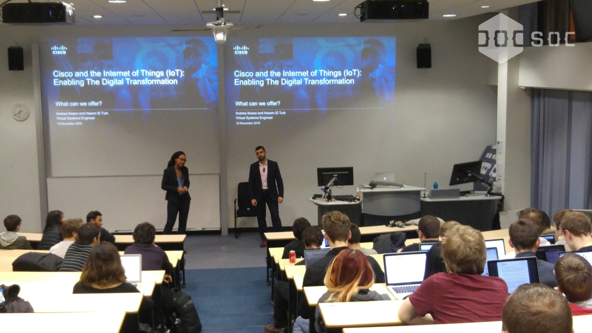
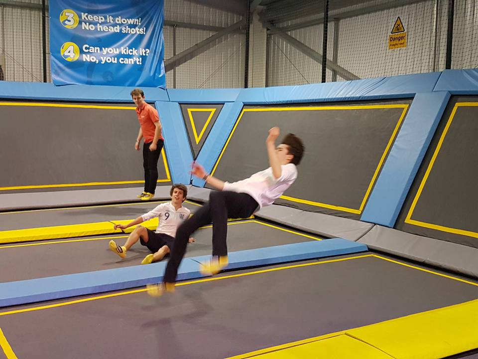
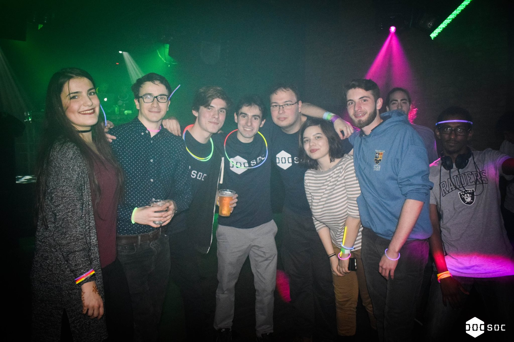
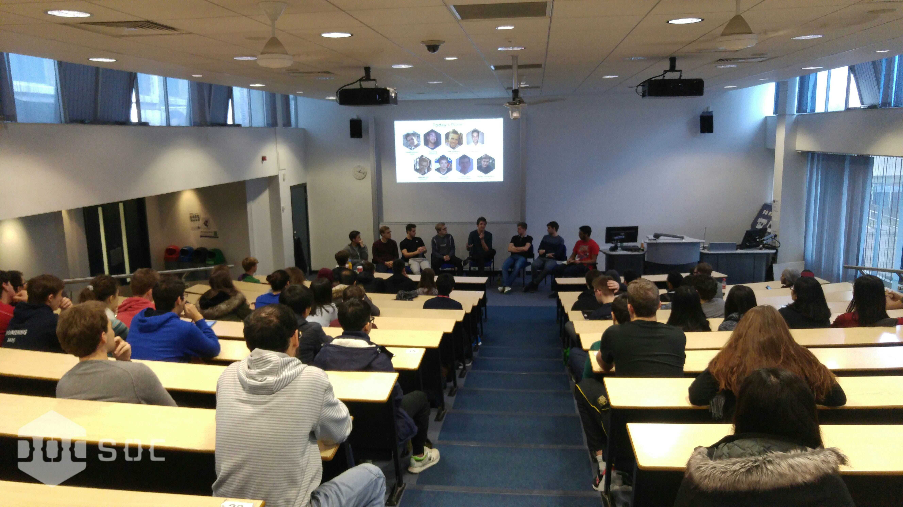
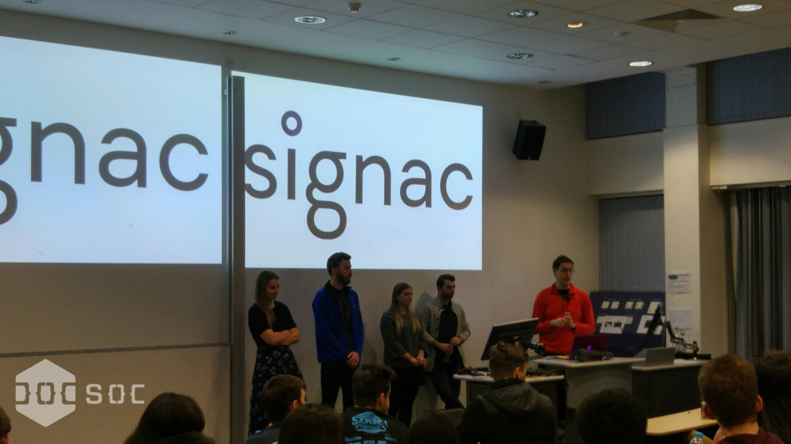
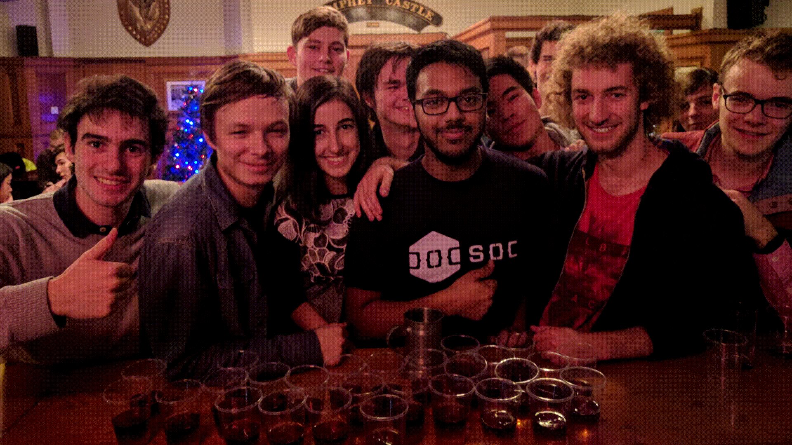

*This post continues on from [Part One](/articles/2016-12-19-autumn-part-one/) of the [Autumn 2016 Review](/articles/2016-12-19-autumn-part-one/) - we simply did so much this term that it’s impossible to limit it to just one blogpost!*

Board Games Evening
=======
In collaboration with the Imperial Board Games Society, our annual board games night returned with great success. Many of our students turned up to share their love of board games, from *Monopoly* to *Settlers of Catan*. Students enjoyed great conversation, an abundance of snacks, and of course an awesome selection of board games! In fact, the event was so successful that we’d love to hold more than just this year!

Cisco: Internet of Things Talk
========================
One of our awesome sponsors, Cisco, visited us in November for a talk about the Internet of Things (IoT) from Andrea Ibiassi, a Virtual Systems Specialist. The talk covered Cisco’s role in IoT, what Cisco is currently doing in that area and how their IoT portfolio creates compelling solutions for Manufacturing, Oil & Gas, Utilities, Energy and Transportation to name but a few. The talk was concluded with a Q&A session and pizza!

Tri-Society Trampolining
==================================
We teamed up with the Imperial BioChemSoc and ChemSoc for a fun-filled Saturday afternoon of trampolining in Acton. We slashed the price of tickets by 50%, and gave a free pair of socks to every attendee. Much fun was had by all, and we’ll definitely collaborate with the other DepSocs in the future.

*Trampolining has its ups and downs...*

The Winter Mixer
==============================================================
The Mixers have become something of a London tradition in recent years; technology societies from each university come together for a night of mingling and mixing over food and drinks, each time hosted by a different society. This term, it was our turn at hosting! 

Held in Metric, it proved to be a great night with a DJ, photographer, flowing drinks, glowsticks, and lots of mingling. We were visited by UCL’s TechSoc, King’s College London’s TechSoc, Goldsmith’s Hacksmiths, and City University’s tech society. Thanks to everybody who came, and we look forward to visiting you all again at your universities!

*Mingling done wrong.*

Internship 101
=============================
Internship 101 is our annual knowledge-share where a panel of students from the Department dedicate some of their time to educate others about their personal internship experiences. Particularly useful for first and second year students, the panel with experience from Apple, Mozilla, Microsoft and others answered questions about company culture, interview questions, salaries, and much more!

Signac Presentation and Networking
=============================
At the end of November, our new sponsor Signac paid us a visit to talk about their startup and how they came into existence as a collaboration with Credit Suisse and one of our other sponsors, Palantir. We were even lucky to be visited by the CIO, Sean Hunter. The talk covered how Signac uses technology and data to stop employee fraud, how they reduce operational risk at banks, and what it’s like working at their startup. Many members of the Signac engineering, HR, and corporate teams participated in what was a fantastic talk and Q&A session. The evening concluded with networking over pizza and drinks.

*Absolutely packed!*

DoCSoc Goes Ice Skating
=======================
Getting into the festive spirit, DoCSoc blessed the Natural History Museum’s Swarovski Ice Rink with 40 of the Department’s finest skaters. Not only that, we slashed ticket prices by 80%, ensuring that as many people as possible could attend. The event proved so popular, in fact, that we did the whole thing again the following week!

Christmas Party
============================
A new event for DoCSoc, this year we held a Christmas party in the Department. We enjoyed festive nibbles and mulled wine, followed by video games, pass-the-parcel, and ended the night with a fantastic grime performance by some of our members.

<!--

*Phishing for Fun and Profit*
-->

The Alumni Bar Night
================
To mark the end of a terrific term, we decided to treat everyone with a final bar night to say goodbye to the Autumn term and 2016. As usual, we gave out hundreds of free tokens, and topped it off with nachos and curly fries to seal the deal. A great way to unwind before saying goodbye to everybody for the Christmas!

*Carrying on the tradition.*

Phew, and there we have it - twenty amazing events! None of this would have been possible without support from the committee, the Department, our Operations team, and of course our invaluable sponsors. A huge thank you to everyone who helped organise, and of course attended our events - they wouldn’t be the same without you!

What's Next?
============
So, what’s to look forward to in the Spring, I hear you ask. Coming up in 2017, we have:

* Talks and workshops from our sponsors: GoCardless, Microsoft, Bloomberg, NewVoiceMedia, and more…
* Many more bar nights
* More trampolining!
* Rooftop Revel 2.0
* IC Hack ‘17 (stay tuned for more details!)
* And much, much more…

Thanks for reading and have a great holiday!

*Tom*