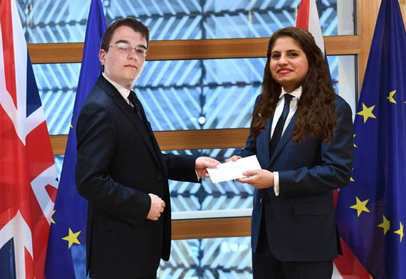
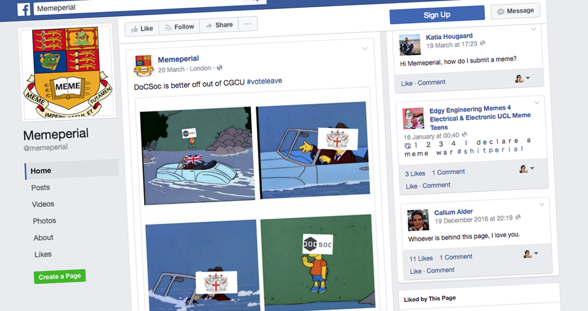

Imperial Computing Society has voted to LEAVE the City and Guilds College Union after a historic AGM in which members rejected the advice of committee leaders and instead took a plunge into the unknown.

The decision in favour of the exit, coined ‘Git Out’ in reference to the popular version control system, represents the biggest shock to the Union since the City and Guilds College merged with Imperial College in 1910. The result comes after months of debate and controversy in to the future of the society.

In the wake of the vote, the JMC Departmental Representative has pledged to hold an independence referendum “at the earliest opportunity”. Rachel Lee claimed it would be “democratically unacceptable” for JMC to be taken out of the Union against its own will, given that JMC and EIE students voted overwhelmingly to remain. In an earlier statement, she claimed that a vote to secede from DoCSoc could result in a ‘Department of JMC’ and subsequent ‘JMCSoc’ which could formally attempt to reenter CGCU.

However, many commentators have argued that an independent JMCSoc would be unlikely to be accepted into CGCU, due to the power of veto, held by the Electrical and Electronic Engineering Society (EESoc). EESoc faces a strong separatist movement from members studying EIE. EIE students currently have a joint sovereignty agreement in place, with sovereignty shared by DoCSoc and EESoc.

The President of the City and Guilds College Union, Milia Hasbani, said it was not a moment for hysterical reaction. Speaking on behalf of the seven engineering departmental societies, she said they were all determined to maintain unity.

The Chair of EESoc is in fact reported to have commented the result of the AGM meeting saying “It is a hard Git Out or no Git Out at all”. These words come after a decade-long fierce rivalry between DoCSoc and EESoc in being the leading society within CGCU, title acknowledgedly held by the former until now.

A dissenting opinion comes from the Chemical Engineering Society’s President: “DoCSoc doesn't stop being a big CGCU partner. As Professor Ian Hodkinson has shown on many occasions, almost all underperforming Computing students end up joining the Chemical Engineering Department, and it is in the best interests of ChemEngSoc, and indeed CGCU as a whole, to maintain good relations with DoCSoc”.

Pro-CGCU James Long, the President of DoCSoc who called for the vote to be held, resigned almost immediately after the result became clear. In his resignation speech, he said, “I will do everything I can as president to steady the ship over the coming days, but I do not think it would be right for me to try to be the captain that steers our society to its next destination.”

*Long and Hasbani have been pictured together in the past.*

Despite giving this assurance, Long resigned not many hours after the AGM, being temporarily replaced by current DoCSoc Secretary, Tom Bower. Many have criticised the lack of energy and passion in the campaigning of DoCSoc Stronger In CGCU - the official remain campaign, which Mr Long and Mr Bower both supported.

Acting President Tom Bower will today set out DoCSoc’s negotiating position, as Article 50 of the CGCU constitution is invoked later today. DoCSoc’s ambassador to CGCU, Sir Alessandro Barrownardi (also known as “Tim in Ruislip”), will hand a letter to President Hasbani to officially trigger the start of up to two-week’s worth of Git Out negotiations, which could see non-Computing members of DoCSoc and Computing members of other departmental societies used as what many people term, bargaining chips. In a leaked memo, Bower wrote, “Non-DoC students make a fantastic contribution to our society, but it's time we stop limiting ourselves to Imperial students.”

A key player and known CGCU-sceptic, Luke Granger-Brown, is said to have been seen carrying a handwritten note after a recent committee meeting stating “What’s the model? Have our pizza and eat it. [...] EESoc likely to be most difficult”. However, a spokesperson for the society later stated that the notes held by Mr Granger-Brown did not reflect the society’s official stance on negotiations.

DoCSoc’s controversial President-elect and co-chair of the LEAVE.CGCU campaigning group, Maurice Yap, has said of the result, “This is a truly momentous occasion, where DoCSoc’s members have decisively chosen to leave behind the bureaucratic mess that is the CGCU, and instead, take back control of our glorious society.”

Referring to the hotly contested amount which DoCSoc pays to CGCU, Mr Yap said, “Let’s take the £350 each year which we give to an undemocratic, crooked organisation with unprecedented power over DoCSoc and spend it on the kitchen instead.” Many have criticised DoCSoc’s handling of the Computing Department’s communal kitchen crisis, saying that it is under-funded, under-resourced and under-staffed.

“Members of DoCSoc do not want “ever-closer Union”, especially not as part of an undemocratic and unaccountable body which DoCSoc members didn’t elect. Members thankfully didn’t buy the Project Fear nonsense spouted out by the lefty liberal champagne socialist Felix newspaper.” 

*Memeperial has been criticised by remain voters for 'deceptive' memes*

DoCSoc’s move has also sparked an upsurge in support for anti-CGCU movements in other departmental societies. Speaking to the populist and pro-Git Out news outlet, Memeperial, a senior committee member in the Design Engineering Society said, “Computing isn’t a real engineering subject anyway - everyone knows that but is too afraid to say it. I applaud the gallant decision of DoCSoc members to leave CGCU. Everyone will see that they are better off out of it, when they continue to make a success of themselves.”

# Article 50: the people who will negotiate DoCSoc’s Exit

## CGCU Negotiators

### Andrew Olson

A seasoned master of CGCU and ICU diplomacy, chief negotiator Andrew Olson will go head-to-head with DoCSoc’s Git Out Coordinator, Luke Granger-Brown.
They used to be sparring partners in the 2014/15 year, when they were rival committee members of their departmental societies with contrasting visions of the CGCU.

### Claudia Caravello

One of “the Union’s best and brightest“, according to its President, Milia Hasbani - was picked as Mr Olson’s deputy chief DoCSoc Exit negotiator earlier this week.

This Civil Engineering student is best known as a veteran at representing CivSoc and its interests. This should stand her in good stead for DoCSoc’s exit from the Union, which she will be helping to engineer in a civil manner.

## DoCSoc Negotiators

### Luke Granger-Brown

A former Internet Services Developer, who grew up in the heavily polluted environment of back labs, Luke Granger-Brown is a Union hack who had carved out a career as an omnicompetent safe pair of hands, before being handed the brief of Git Out Coordinator.

### Alessandro Barrownardi

A career Italian, with a reputation as a flamboyant, but orthodox pasta chef, Sir Alessandro Barrownardi was drafted into the role of DoCSoc ambassador to CGCU following the resignation of James Prince, who had accused the DoCSoc committee of “muddled thinking” over Git Out.

---

More updates are expected as events unwrap this week.
