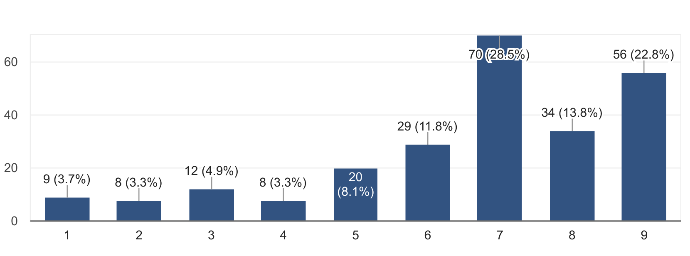

```
---
title: DoCSoc Member Experience Survey 2017 Report
author: DoCSoc
date: 2017-09-25 12:00
template: article.jade
---
```


Hello there, lovely members of DoCSoc! Back in April, we asked you to fill out a survey for us regarding your experience with DoCSoc this past year. Well, we've taken a long hard look at the data and the results have been very educational for us and will certainly aid us in trying to improve DoCSoc as a community and society for this upcoming year.

Anyways, we'd just like to take this chance to show you the results and talk about some of the responses!

## Table of Contents
- #### The split between Academic and Social Events 
- #### Events this year
- #### Joint Society Events
- #### Other Suggestions and Misc.

## The split between Academic and Social Events


This was a surprisingly good result! I mean, look at those sexy curves on that almost-Gaussian-Distribution! This was something we were initially somewhat concerned with, as we've previously heard complaints (from both sides) before. However, it looks like our concerns were unfounded&hellip;

On a more serious note, we'll continue to work hard to bring you a large range of both social and academic events this upcoming year, so stay tuned!

## Events this year
### Bar Nights
_Bar Nights_ were by far the most popular events - with over 80 responses mentioning either a specific bar night or all of them collectively. This was a *shocking* revelation to us as we would never have expected that large quantities of free alcohol could be so incredibly popular amongst university students. We're glad that DoCSoc's bar nights have gained the popularity and legendary reputation that they have; in fact the College Union has now asked us to switch our venue to Metric due to the large volumes of attendees.

_Bevs_

_Good chance to meet new people from the course and from other years_

_A chance to sit down with friends that I otherwise only see in lectures_

At the same, Bar Nights were _also_ the most disliked, with over 30 people putting them down as their least favourite event:

_Im not that interested in drinking._

_Boring as most club and societies do this already_

_Union bar is too overcrowded and the service is incredibly slow_

_Too many dudes_

_bar nights and alcohol arent really my thing!_

_I don't drink_

_dont like going to pubs_

That said, some of the "Least favourite" reasons were:

_Had too much to drink :(_

_I died (was lit otherwise)_

It's no surprise that the Bar Nights are the most controversial events. After all, we're a very diverse community of people ranging from raging alcoholics to complete teetolers.
The serious criticisms of the Bar Nights fall into one of two categories: either the lack of interest in drinking, or the venue being too busy. After much debate, we've come to the consensus that the frequency of bar nights are in a good spot right now, and we will keep the number of bar nights for this upcoming year the same as last year.

This doesn't mean that we're not listening to the non-drinkers; we believe we can up our game with non-alcohol social events this year without affecting the quality of the Bar Nights which are beloved by many others. We'd also like to mention that this year we'll be moving to Metric for our main Bar Nights. This should hopefully solve or mitigate a lot of issues with the congestion and long bar queues.

### Revel
**Revel** AKA **Cirque le Revel** AKA **Revel 2.0** was also another controversial event. This was our second year running Revel, and after the massive success and positive feedback we had from last year's Rooftop Revel, we had *a lot* to live up to.

_Unlimited booze and cool venue_

_Variety, different to any night I've ever been on_

_Entertainment was great_

_A lot of people and a lot of fun_

_MAGNIFICENT_

_Well it was bloody brilliant. The location..._

_It didn't seem worth the money and it ended early_

_In comparison to the Rooftop from the year before it fell kind of short. It was too packed and the show acts were kind of embarrassing to watch._

_Quite expensive, venue wasn't big enough for everyone and they ran out of wine and water quite early on_

_It was not what I was expecting. The tickets were expensive and it overall wasn't worth the money._

_Bit overhyped, I think we could have done better for the price (compared with the last year's rooftop revel which was awesome)._

_Was too weird_

A lot of the feedback we received was very similar to that of the bar nights, and we do agree that generally non-drinkers did not enjoy the event as much, and many drinkers also were very critical of the venue being too loud, too small and having no "quiet area" like Rooftop Revel did. The main reason we didn't go with the Roof Gardens again this year was that they lost their license, hence we had to find an alternative. This year, though we haven't started formal planning on Revel yet, the committee is considering going back to the Roof Gardens (as they have regained their license).

Something else we're also taking in mind is the subsidy amount and availability of the tickets. Many DoCSoc members were unhappy that many tickets went out to +1s before they themselves had a chance to buy them. We're considering implementing a new system that prioritises DoCSoc members. We're still in the early stages of discussion, so nothing's for certain yet, but we are very keen on prioritising DoCSoc members whilst still having enough tickets for +1s. A budget increase for Revel has also been approved, which should also help a lot.

### ICHack
**ICHack** was by far the most expensive event we ran this year and took months of preparation from the committe, and it's great to see that our hard work has been appreciated with the hackathon being voted to 2nd place.
Our ambitions were very high this year, going from a measly 150 attendees in the previous ICHack to a staggering 335, so we're _really_ happy that you guys enjoyed it as much as you did, as the committee and organizers almost died running it.

_It was organised extremely well and was really fun_

_Really huge event. Free food. Great prizes. Great sponsors and establish career connections._

_Because Pizza. Also first Hackathon so a really cool experience. The sponsors were also super nice!_

_Most exciting of all the events, I had a great time and learnt a lot as well_

_God organization_

_Lit af_

Thanks guys <3
We also received very few responses where ICHack was down as least favourite event, so I can go through them all individually here:

_Too many people_

Well, we wanted to give as many people as we can the opportunity to participate. We're sorry if you feel like this compromised your enjoyment of the event. If you want to give us more details, drop us an email at <docsoc@imperial.ac.uk>.

 _I didn't like that it was held at uni, made me feel like I was just spending a weekend in the place I want to get  away from. Also I didn't like any of the meals...except dominoes_

Tieing in with the above point, the only venue we could get that would allow us to host such a large amount of people, and not cost every committee member their kidneys, was on College Campus. With regards to the meal, we weren't allowed to use external catering this year, but we're hoping to change that next year, so hopefully food should be much improved.

### Sponsored Talks and Workshops
Our **Sponsored Talks and Workshops** were also overall well received. In particular, the **Palantir Startup** and **Netcraft Phishing for Fun and Profit** seemed to be particularly well-liked.

_Really interactive_

_Fun and mostly accessible_

_An interesting coding challenge_

_The talk was very interactive and very interesting_

_Nice and short workshop_

_Fun workshop with an insight into their company, free food + bar night was cool as well_

And amongst the criticisms we had:

_Too much set-up for the workshop, task seemed very long and wasn't particularly engaging_

_Config files are boring_

_Speaker was not very good - more of an advertisement than a technical/academic talk_

_I fell behind and was unable to catch up due to the format of the presentation. It seemed like others had similar issues with falling behind. I still gained something from it but it would have been nice if there was more information about how the systems worked rather than being so focused on configuring it quickly to get it working_

This category of events is a difficult one for us to work on, as the events themselves are run by our sponsors. We're happy that overall people seemed to enjoy them, however we've also passed on feedback onto our sponsors in order for them to provide a better experience for our students during their workshops and talks this year.

### Ice Skating
**Ice Skating** was also _extremely_ well received - many praised the large discounts and the opportunity to relax and socialise with others in the context of enjoying a seasonal activity. We're looking to do more of these social events this year, stay tuned.

### Web Development Workshops
**Web Development Workshops** were something that we tried running for the first time this year, and we've had feedback ranging from extremely positive to, well, dull. We understood that it initially had a lot of momentum starting out, but fizzled out after the first few lectures due to lack of organization, poor attendence and slow pacing. We're hoping to use the lessons we've learnt to improve and restructure these workshops to make them more engaging and valuable this year.

___

We also received some&hellip; _interesting_ responses about events:


Least Favourite Event : **_"Corporate presentations without pizza"_**

All of our events have pizza. You must be thinking of the DoC ACI talks. Not DoCSoc.

Least Favourite Event: **_"All DoCSoc events, because THE RATIO"_**

Try Tinder, bud.

Least Favourite Event: **_"ones about computers - I do not know about that stuff. I can use microsoft pretty well and that's it"_**

Glad to know we've got friends in the Business school.

Favourite Event: **_"Pub Crawl"_**

....dude, what pub crawl are you on about? We've never had a DoCSoc pub crawl...

## Joint Society Events 

Events with other societies are something that DoCSoc have never really pushed for before, but your responses indicate that there is significant interest in these:



Hence it goes without saying that we're going to look into this a lot more. That said, the reality is not so simple as merely hosting more events with other Socs just because we feel like it - with Joint-Soc Events come Joint-Soc problems.

**Good events are not cheap**, and most other societies **do not have the money that we do**. For example, our Bar Nights are expensive. They range anywhere from £2000 to £4000, and if we were to invite another society along, this cost would likely double. The committee believes that it is not within our interests to use DoCSoc sponsorship funds on non-DoCSoc members, and so this would require either the other society to cover their share of the expenses, or their members to pay for a ticket. This essentially takes away a large proportion of the incentive for other society members to attend, considering that there are likely already many reasons members of other societies may not want to participate in co-society events i.e. clashing exam/coursework timetables during term-time.

DoCSoc's reputation is amongst the largest of any society at Imperial, and because of this we also have concerns regarding other societies expecting us to carry them in any potential joint ventures. In the past, we have had a certain student organisation propose that we cover 70% of the expenses for the event, whilst only getting a third of the tickets.

<!-- TODO: insert stuff about difficult to organize here -->

The above issues don't mean we won'try, it just means that we'll be proceeding quite carefully in order to not waste DoCSoc $$$ and manpower.
We will likely be trialling events with other societies with relatively inexpensive social events (so, not Bar Nights) and see how popular they are before becoming more ambitious.

## Other Suggestions and Misc.

Many of the suggestions we've received have already been addressed somewhere above, but for those that didnt:

_Being more transparent with what is going on, not just on the commitee, but with how each event went_

Well, I hope this whole report is a good start. We're looking to become more active with our blog this year, with content from anything ranging from post-event writeups to sponsorship news, so hopefully this answers your request.

_More diversity for companies coming to engage the students (e.g. game developers, social media)_

Though we can't tell you who are sponsors this upcoming year are quite yet, we've contacted 239 companies with from various fields and backgrounds this year, so stay tuned&hellip;

_Get the hoodies and other clothing items out way sooner_

This was something we were thinking of as well. Especially with the next batch of freshers coming in soon, it does make sense to get them out a tad bit earlier.

_Take more personal feedback not general forms_

Feel free to drop us an email at <docsoc@imperial.ac.uk>

_Have more workshops such as the webdev one_

Noted. We'll discuss this.

_More food-based activities rather than alcohol-based_

We hope you came to the BBQ! Now that we've bought ourselves a grill, doing more of these is definitely something we have in mind.

_Organize more graduate student events_

We believe most of our events are appropriate for both undergraduate and graduate students - but if you disagree with us, drop us an email and tell us why!

_Laptop spots in labs with VGA/HDMI inputs and keyboard/mouse available_

Forwarded to the Departmental Representatives.

_More academia focused events_

Also something we're working on. Once again, stay tuned.

___

That's all we wanted to say for now. In the coming weeks we'll also be letting you know of a few more changes and updates to DoCSoc this year, so stay tuned for that.
